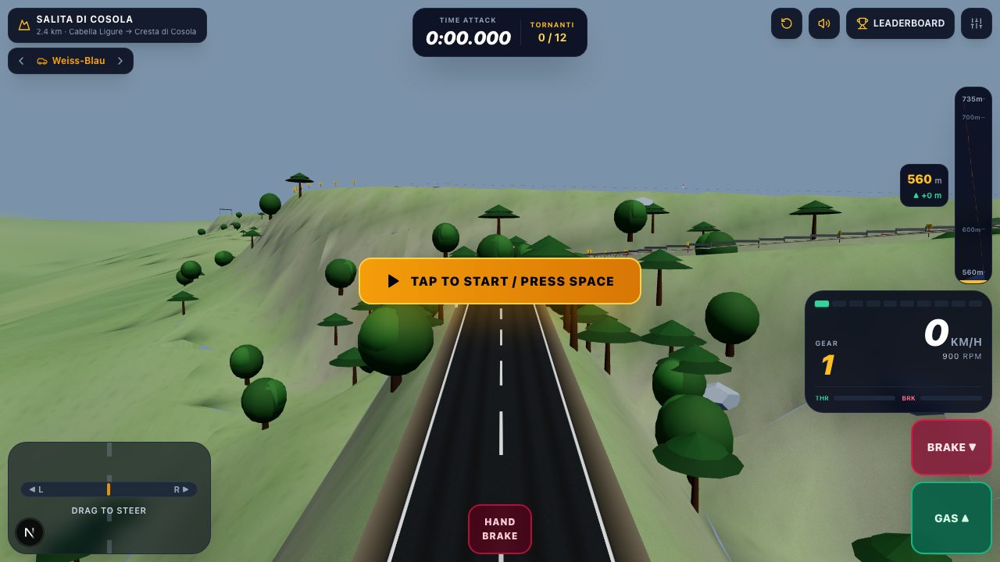

# Hillclimb

A browser-based, high-performance 3D racing game built from scratch using **Next.js**, **Three.js (Vanilla WebGL)**, and a **Custom Deterministic Physics Engine**.

**Play it: [borbera108.vercel.app](https://borbera108.vercel.app)**


*Salita di Cosola: the switchback spreads across the hillside rather than stacking, so every metre of it sits on ground.*

| Borbera Sprint | Salita di Cosola |
|---|---|
|  |  |
| 3.7 km along the valley floor, with the Borbera and its gravel bed | 2.4 km and twelve tornanti, climbing 175 m to the Cosola ridge |

*Screenshots are generated reproducibly from fixed camera poses via `npm run visual-check`.*

## Why This Project Stands Out

This project intentionally avoids off-the-shelf game engines (like Unity or Unreal) and pre-packaged physics libraries (like Cannon.js or Ammo.js) to demonstrate deep understanding of core 3D math, physics simulation, and rendering optimization. 

Key engineering challenges solved in this project include:

### 1. Custom Deterministic Physics Engine
Instead of relying on black-box physics libraries, the vehicle dynamics are simulated entirely from scratch. The interesting problem here is not model complexity — it is **bit-level reproducibility across JavaScript engines**, because the anti-cheat re-simulates every submitted run server-side and compares it to the claimed time within a 5 ms tolerance.

- **Fixed-step semi-implicit Euler**: A 60 Hz fixed timestep driven by an accumulator, interpolated for rendering, so the simulation is entirely frame-rate independent. Semi-implicit (symplectic) Euler is chosen over a higher-order integrator deliberately: at a fixed 60 Hz it is stable for this model, and every extra force evaluation is another opportunity for cross-engine floating-point divergence.
- **Deterministic math kernel**: `Math.sin`/`cos`/`tan`/`atan2` are **not** bit-identical across V8, JavaScriptCore and Hermes, so the entire simulation path routes through a hand-written kernel (`deterministicMath.ts`) built only from `+ - * /` and comparisons. A source-purity test scans every file on that path — vehicle, spline, timer, track builder and stage definitions — and fails the build if a native trig call or `Math.PI` appears in any of them.
- **Tire model**: Slip angles are computed per-axle from the velocity vector and yaw rate, producing a lateral force that is linear in slip angle up to a grip ceiling scaled by surface, downforce and handbrake state. This is a deliberate simplification, not a Pacejka curve — there is no peak-then-falloff beyond the limit, and longitudinal and lateral forces are currently clamped independently rather than sharing a friction circle. Combined-slip coupling is the most worthwhile next step for the handling model.
- **Verified end to end**: The re-simulation runs the real `VehicleModel` against the recorded input trace on the Edge runtime and reproduces the client's time and penalty totals exactly, including across off-road respawns. That equivalence is asserted by the test suite on every stage.

### 2. Procedural 3D Generation & Rendering
- **Spline-Based Track Generation**: The road geometry, complex switchbacks (tornanti), and varying camber are generated dynamically at runtime from Frenet-Serret frames along mathematical splines.
- **Unified Height-Field Terrain**: Near ground and distant mountains are one continuous surface — a single height field sampled by a single mesh builder, rather than two independently-generated surfaces that have to be kept in visual agreement. The field composes a base-altitude layer, a world-space ridge layer, and a road-carve layer that takes a minimum over every road tier within 90 m (each faded toward the surrounding landscape by its own falloff), which is what guarantees the ground stays below every nearby road, including both tiers of a stacked switchback. Ground clearance beneath the road is a property of the field itself rather than a post-process, so terrain intruding on the racing line is unrepresentable rather than merely tuned away. Geometry is built as a distance-graded quadtree — 4 m cells at the roadside easing out to 256 m at the horizon, with LOD skirts closing the seams between cell sizes — then spatially chunked so the WebGL frustum culler can still reject unseen geometry. Measured per-stage terrain triangle counts run 25k–42k (about a fifth of that is skirts), with full-scene totals (road, terrain, props, vegetation) of 87k–99k across the two stages. Generation is the whole of the load time — around three seconds, dominated by the carve resolving 400–900 road samples per vertex — so it runs a slice at a time with the event loop given a turn in between, which is what lets the loading screen paint and report real progress instead of freezing.
- **Procedural Textures**: Utilizing the HTML5 Canvas API to generate high-frequency micro-detail noise maps and asphalt grain procedurally, drastically reducing network payload size without sacrificing visual fidelity.

### 3. Server-Verified Anti-Cheat
Leaderboard times are not trusted from the client. Submitting a run sends the full input trace, and the Edge runtime replays it through the identical `VehicleModel`, `TrackSpline` and `Timer` used in the browser:
- The submitted time must match the re-simulated time within 5 ms, which is only achievable because the whole simulation path is bit-reproducible (see above).
- The replay must actually reach the final checkpoint — a trace that merely runs long enough is rejected, since elapsed time alone is just a frame count.
- Run tokens are HMAC-signed over `runId | stageId | carId | issuedAt | simVersion`, expire in 30 minutes, and a wall-clock check rejects submissions faster than real time.
- `SIM_VERSION` re-keys the leaderboards whenever anything on the simulation path changes, so runs recorded under different physics can never be ranked against each other.

### 4. Dynamic WebAudio Synthesis
- A custom audio orchestrator synthesizes the vehicle's engine sound dynamically using the Web Audio API. Pitch, volume, and resonance are mapped in real-time to the engine's RPM, gear state, and throttle load, creating an authentic, reactive auditory experience without looping static MP3s.

## Tech Stack
- **Frontend Framework**: Next.js (App Router)
- **Language**: TypeScript
- **3D Rendering**: Three.js (Vanilla WebGLRenderer — no react-three-fiber in the hot path; the renderer is a plain imperative class driving a bare `<canvas>`)
- **Styling**: Tailwind CSS (UI Layer)

## Running Locally

To run the game locally, you'll need Node.js installed.

1. Clone the repository:
   ```bash
   git clone https://github.com/flawnull/hillclimb.git
   cd hillclimb
   ```

2. Install dependencies:
   ```bash
   npm install
   ```

3. Start the development server:
   ```bash
   npm run dev
   ```

4. Open [http://localhost:3000](http://localhost:3000) in your browser.

> **Note**: Avoid running `npm run build` and `npm run dev` concurrently, as they share the `.next` directory and can cause cache corruption.

## Deploying

The game itself is fully client-side after the first load; only the leaderboard and run-token
endpoints need a backend, and both are tiny Edge functions. Vercel's Hobby tier plus
Upstash's free tier covers it at no cost.

**1. Provision Redis.** Create a database at [upstash.com](https://upstash.com) (free tier:
10k commands/day). Redis is not incidental here — the leaderboard is built on sorted sets
(`ZADD`/`ZSCORE`/`ZREMRANGEBYRANK`) for ranked insertion with per-player deduplication and
automatic trimming to the top 1000. Copy the REST URL and token.

**2. Set environment variables** in the Vercel project settings. All three are required in
production; the app fails loudly rather than silently degrading if any is missing:

| Variable | Notes |
|---|---|
| `RUN_SECRET` | HMAC key for run tokens. Generate with `node -e "console.log(require('crypto').randomBytes(48).toString('base64url'))"`. **Never reuse the development fallback** — it is a literal in this public repository, and anyone could use it to mint valid tokens and post forged times. |
| `UPSTASH_REDIS_REST_URL` | From step 1 |
| `UPSTASH_REDIS_REST_TOKEN` | From step 1 |

**3. Deploy.** Import the repository on Vercel; the defaults are correct for Next.js. The
API routes run on the Edge runtime, which is what lets the anti-cheat re-simulation run close
to the user.

**4. Verify the deployment** by pointing the smoke test at it:

```bash
SMOKE_BASE_URL=https://borbera108.vercel.app npm run smoke
```

It drives a real run in a headless browser and fails on any console error, so a missing
environment variable or a broken build surfaces immediately.

### Notes

- Without Redis configured the game still plays; the leaderboard reports itself as
  unavailable and personal bests continue to be stored locally in the browser.
- `SIM_VERSION` keys the leaderboards. Changing anything on the simulation path re-keys them,
  which retires existing entries by design — runs recorded under different physics must never
  be ranked against each other.

## Testing

The custom physics and rendering budgets are strictly enforced by a comprehensive test suite.
```bash
npm test
```
*(Currently 241/241 physics, rendering, terrain, input, anti-cheat and mathematical constraint tests passing.)*

Two browser-driven scripts cover what unit tests cannot. Both need a dev server
(`PORT=3001 npm run dev`):

```bash
npm run smoke          # starts a run, drives, checks the timer, modals and shortcuts
npm run visual-check   # captures fixed camera poses per stage to scratch/visual/
npm run finish-run     # drives a full stage to the finish line (~3 min of real time)
```

`smoke` exercises the paths that span React, the imperative renderer and the input layer at
once — exactly where a regression hides from `npm test`. `finish-run` installs a driver
inside the page and plays a stage through to the line, which is the only way to cover the
finish callback, personal-best save and result modal; the simulation is locked to real time
by `requestAnimationFrame`, so it cannot be fast-forwarded. `visual-check` renders from fixed
poses so terrain changes can be compared across runs; the screenshots above come from it.
